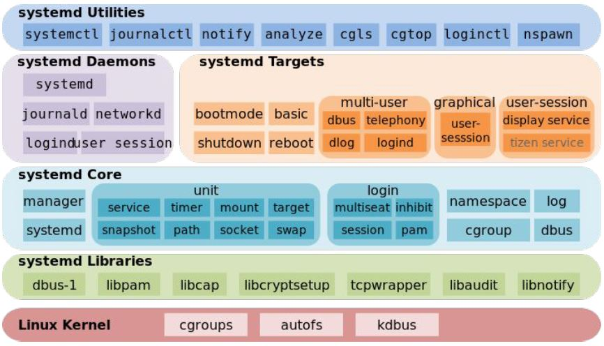

# Загрузка системы.

1. init
1. Daemon / Демон
1. Классический init и уровни исполнения
1. Проблемы SysV сервисов
1. SystemD

---

1. ### init - это __подсистема инициализации__ в Unix и ряде Unix-подобных систем.
    - __запускает__ все остальные __процессы__
    - обычно процесс __/sbin/init__
    - имеет __PID__ __1__
    - может быть изменена параметром ядра __init__
        - vmlinuz init=__/bin/sh__

1. ### Daemon / Демон - это процесс, который не даёт себя убить.
    1. __при запуске закрывает__, чтобы не получить SIGHUP, открытые по-умолчанию файл-дескрипторы:
        - __STDIN__
        - __STDOUT__
        - __STDERR__
    2. чтобы родитель не получил SIGCHILD, __отвязывается от родительского процесса__ используя:
        - __fork()__
        - __setsid()__

1. Классический init и уровни исполнения.

    - __/etc/inittab__ - файл конфигурации
    - __/sbin/telinit__ - утилита управления

    1. AT&T style
        - один скрипт инициализации
        - пользовательские программы запускаются через rc.local
        - используется в FreeBSD до 5.0, OpenBSD
    
    1. SysV style
        - появились уровни исполнения:

            0. __halt__ - выключение
            0. __single user__ - отладка
            0. __multiuser without network__ - стандартный консольный режим, но без доступа к сети
            0. __full multiuser__ - стандартный консольный режим
            0. __custom__ - настраиваемый режим, обычно не используется
            0. __X11 GUI__ - графический режим
            0. __reboot__ - перезагрузка

        - директории:
            - __/etc/rcN.d/__ - скрипты инициализации уровня N (0-6)
            - __/etc/rc.local/__ - скрипты, которые __запускаются после скриптов уровня N__

        - все скрипты умеют обрабатывать команды:
            - start
            - stop
            - restart
            - status (опционально)
        
            [Пример скрипта-сервиса SysV](8_sysv_service.sh)

1. Проблемы SysV сервисов:
    1. линейное исполнение - все скрипты запускаются поочерёдно
    1. отсутствие зависимостей - нет возможности указать какие сервисы должны быть запущены для успешного запуска
    1. нет возможности эффективно контроллировать процесс, типовые проблемы:
        - ошибка при запуске
        - двойной запуск
        - процессы-сироты
        - отсутствие возможности перезапустить упавший процесс
            - костыльное решение - monit
    1. большие и сложные init-скрипты
    1. демонизация с помощью shell jobs

1. SystemD - "система инициализации" вобравшая в себя огромный функционал.

    Архитектура SystemD:
    

    - В основе лежат:
        1. __cgroups__ - ограничивает и изолирует вычислительные ресурсы
        1. __autofs__ - монтирует файловую систему, при попытке обращения
        1. __kdbus__ - шина, для общения между приложениями

            В контексте SystemD __cgroups__ решает задачу принадлежности процесса сервису, т.к. любой процесс сервиса будет запущен в той же группе __/sys/fs/cgroup/systemd/system.slice/__.

    - Компоненты SystemD:
        1. __journald__ - системный журнал, в который записываются весь STDOUT сервисов
        1. __logind__ - демон управления аутентификацией пользователя
        1. __networkd__ - демон управления сетью
        1. __tmpfiles__ - управление временными фалами
        1. __timedated__ - демон для контроля времени/даты
        1. __udevd__ - менеджер устройств. Поддерживает __/dev/__ в актуальном состоянии
        1. __libudev__ - библиотека, позволяющая разработчикам делать запросы к udev
        1. __systemd-boot__ - UEFI менеджер загрузки
    
    - Юниты SystemD:
        1. __service__ - аналог демона или что-либо, что можно запустить
        1. __device__ - факт подключения устройства (имя юнита генерируется из sysfs-имени устройства)
        1. __target__ - группирует другие юниты
        1. __mount__ - точка монтирования файловой системы
        1. __automount__ - аналог autofs-точки автомонтирования
        1. __timer__ - аналог cron. Периодический запуск другого юнита
        1. __socket__ - аналог xinetd. Запуск юнита при подключении к указанному сокету
        1. __path__ - запуск юнита по событию доступа к какому-либо пути
        1. __slice__ - группирует другие юниты в дереве cgrouops, позволяя иерархично выставлять ограничение ресурсов
