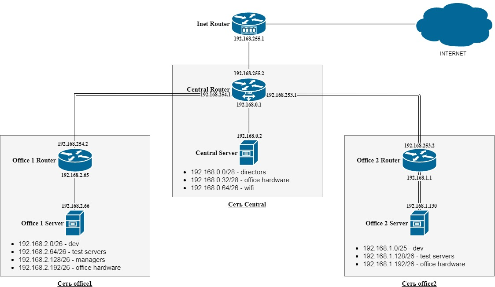

## **Сеть central**
NAME (desc)     | NETWORK         | MASK                 | BROADCAST      | MIN host      | MAX host      | TOTAL hosts
----------------|-----------------|----------------------|----------------|---------------|---------------|---
directors       | 192.168.0.0     | 28 / 255.255.255.240 | 192.168.0.15   | 192.168.0.1   | 192.168.0.14  | 14
office hardware | 192.168.0.32    | 28 / 255.255.255.240 | 192.168.0.47   | 192.168.0.33  | 192.168.0.46  | 14
wifi            | 192.168.0.64    | 26 / 255.255.255.192 | 192.168.0.127  | 192.168.0.65  | 192.168.0.126 | 62

## **Сеть office1**

NAME (desc)     | NETWORK         | MASK                 | BROADCAST      | MIN host      | MAX host      | TOTAL hosts
----------------|-----------------|----------------------|----------------|---------------|---------------|---
dev             | 192.168.2.0     | 26 / 255.255.255.192 | 192.168.2.63   | 192.168.2.1   | 192.168.2.62  | 62
test servers    | 192.168.2.64    | 26 / 255.255.255.192 | 192.168.2.127  | 192.168.2.65  | 192.168.2.126 | 62
managers        | 192.168.2.128   | 26 / 255.255.255.192 | 192.168.2.191  | 192.168.2.129 | 192.168.2.190 | 62
office hardware | 192.168.2.192   | 26 / 255.255.255.192 | 192.168.2.255  | 192.168.2.193 | 192.168.2.254 | 62

## **Сеть office2**
NAME (desc)     | NETWORK         | MASK                 | BROADCAST      | MIN host      | MAX host      | TOTAL hosts
----------------|-----------------|----------------------|----------------|---------------|---------------|---
dev             | 192.168.1.0     | 25 / 255.255.255.128 | 192.168.1.127  | 192.168.1.1   | 192.168.1.126 | 126
test servers    | 192.168.1.128   | 26 / 255.255.255.192 | 192.168.1.191  | 192.168.1.129 | 192.168.2.190 | 62
office hardware | 192.168.1.192   | 26 / 255.255.255.192 | 192.168.1.255  | 192.168.1.193 | 192.168.1.254 | 62